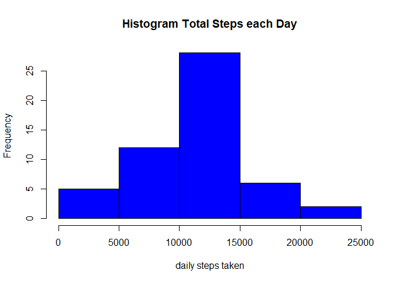
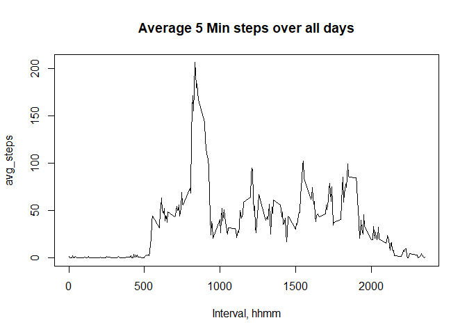
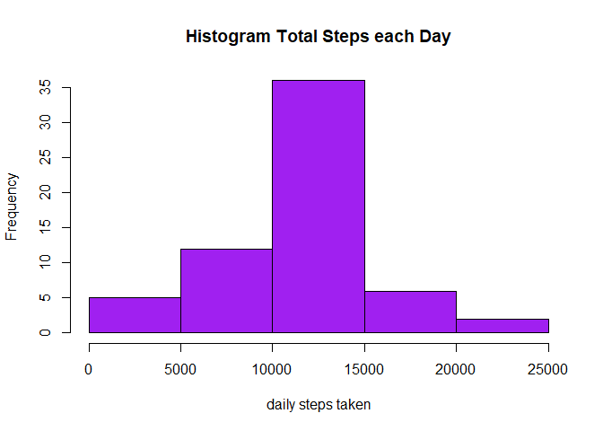
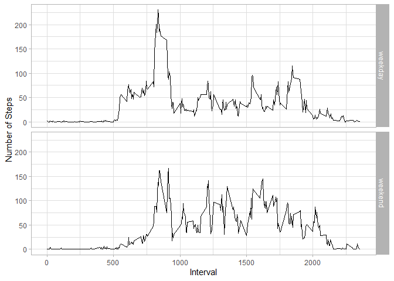

## Loading and preprocessing the data

``` r
library(lubridate)
```

```
## 
## Attache Paket: 'lubridate'
```

```
## Die folgenden Objekte sind maskiert von 'package:base':
## 
##     date, intersect, setdiff, union
```

``` r
library(datasets)
library(dplyr)
```

```
## 
## Attache Paket: 'dplyr'
```

```
## Die folgenden Objekte sind maskiert von 'package:stats':
## 
##     filter, lag
```

```
## Die folgenden Objekte sind maskiert von 'package:base':
## 
##     intersect, setdiff, setequal, union
```

``` r
data <- read.csv(unz("activity.zip","activity.csv",open = "", encoding = getOption("encoding")), na.strings ="NA")
data$date <- ymd(data$date)
data$empty <- is.na(data$steps)
data_clean <- subset(data, !empty)

summary(data)
```

```
##      steps             date               interval        empty        
##  Min.   :  0.00   Min.   :2012-10-01   Min.   :   0.0   Mode :logical  
##  1st Qu.:  0.00   1st Qu.:2012-10-16   1st Qu.: 588.8   FALSE:15264    
##  Median :  0.00   Median :2012-10-31   Median :1177.5   TRUE :2304     
##  Mean   : 37.38   Mean   :2012-10-31   Mean   :1177.5                  
##  3rd Qu.: 12.00   3rd Qu.:2012-11-15   3rd Qu.:1766.2                  
##  Max.   :806.00   Max.   :2012-11-30   Max.   :2355.0                  
##  NA's   :2304
```
## What is mean total number of steps taken per day?

#Create aggregated steps per day  

``` r
daily_steps <- data_clean %>% group_by(date) %>% summarize(daily_steps_sum = sum(steps))


# Create histogram  
hist(
  daily_steps$daily_steps_sum, 
  xlab = "daily steps taken", 
  main = "Histogram Total Steps each Day", 
  col = "blue")
```

<!-- -->

``` r
mean_steps <- mean(daily_steps$daily_steps_sum)
median_steps <- median(daily_steps$daily_steps_sum)
```
1.0766189\times 10^{4} is the mean & 10765 is the median on steps taken each day

## What is the average daily activity pattern?

``` r
interval_avg <- data_clean %>% group_by(interval) %>% summarize(avg_steps = mean(steps))
with(
  interval_avg, 
  plot(
    interval, 
    avg_steps, 
    type = "l", 
    main = "Average 5 Min steps over all days", 
    xlab = "Interval, hhmm"))
```

<!-- -->

``` r
max_step_interval <- interval_avg$interval[which.max(interval_avg$avg_steps)]
```
Over all days, 835 is the interval containing the maximum number of steps  


## Imputing missing values

``` r
missing_value <- sum(is.na(data$steps))
```
There are 2304 NA found in rows of the data set.  
  
To fill in the NAs, we take the average number of steps during that 5 minute interval over all days.

``` r
fill_data <- data
for (i in 1:nrow(fill_data)) {
    if (is.na(fill_data$steps[i])) {
        # Find index value for interval = average
        myindex <- which(fill_data$interval[i] == interval_avg$interval)
        # replace the NA
        fill_data$steps[i] <- interval_avg[myindex,]$avg_steps
    }
}
fill_data$date <- ymd(fill_data$date)

filldailysteps <-  fill_data %>% group_by(date) %>% summarize(filldaily_steps_sum = sum(steps))

# Create histogram  
hist(
  filldailysteps$filldaily_steps_sum, 
  xlab = "daily steps taken", 
  main = "Histogram Total Steps each Day", 
  col = "purple")
```

<!-- -->

``` r
fillmean_steps <- mean(filldailysteps$filldaily_steps_sum)
fillmedian_steps <- median(filldailysteps$filldaily_steps_sum)
```
1.0766189\times 10^{4} is the mean & 1.0766189\times 10^{4} is the median on steps taken each day with filled NA rows.  
The median is now equal to mean.  


## Are there differences in activity patterns between weekdays and weekends?


``` r
fill_data$weekday <- weekdays(fill_data$date)
fill_data$daytype <- "weekday"
fill_data$daytype[fill_data$weekday %in% c("Samstag", "Sonntag")] <- "weekend"

dayaverage <- fill_data %>%
    group_by(daytype, interval) %>%
    summarize(avg_steps=mean(steps))
```

```
## `summarise()` has grouped output by 'daytype'. You can override using the
## `.groups` argument.
```

``` r
library(ggplot2)

g <- ggplot(dayaverage, mapping = aes(interval, avg_steps))
g + geom_line() + facet_grid(rows = vars(daytype ))+labs(x = "Interval", y = "Number of Steps") + theme_light()
```

<!-- -->
